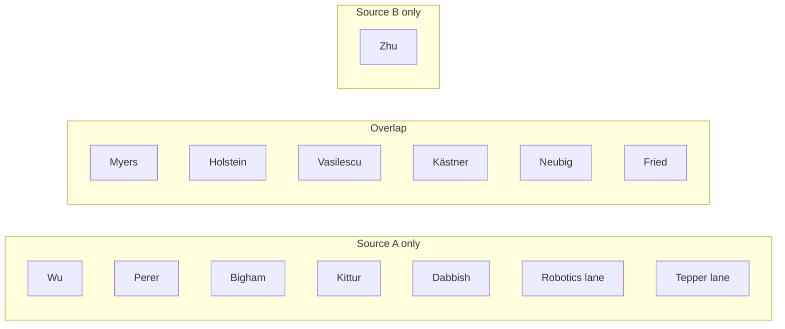
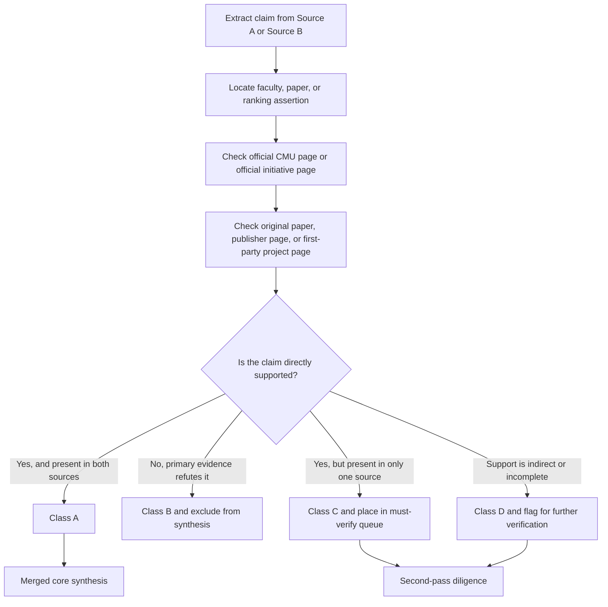

# Synthesis and Verification Report on Two CMU Faculty-Mapping Documents

## Executive summary

Across the two uploaded documents, the strongest shared core is a six-person set drawn from entity["organization","Carnegie Mellon University","pittsburgh, pa, us"]’s entity["organization","Human-Computer Interaction Institute","cmu, pittsburgh, pa, us"], entity["organization","Software and Societal Systems Department","cmu, pittsburgh, pa, us"], and entity["organization","Language Technologies Institute","cmu, pittsburgh, pa, us"]: entity["people","Brad Myers","cmu hci professor"], entity["people","Ken Holstein","cmu hci professor"], entity["people","Bogdan Vasilescu","cmu software engineering"], entity["people","Christian Kästner","cmu software engineering"], entity["people","Graham Neubig","cmu nlp researcher"], and entity["people","Daniel Fried","cmu lti professor"]. On the current evidence, this is the most defensible merged synthesis because each appears in both source documents and can be tied to recent primary evidence that is either directly about AI-assisted software development or very close to it. fileciteturn0file0 fileciteturn0file1 citeturn0search0turn28search0turn1search4turn30search6turn1search6turn1search3

Within that shared core, the highest-confidence software-development-specific anchor set is Vasilescu, Kästner, Neubig, and Myers. Vasilescu has especially strong recent empirical evidence on coding agents and Cursor adoption in repositories; Kästner’s line is unusually strong on integrating LLMs into software products, prompt underspecification, and regression testing for evolving APIs; Neubig has first-party platform and benchmarking work through OpenHands and related code-agent evaluation; Myers brings direct developer-facing evidence on code understanding, AI programming assistants, prompt programming, and interactive testing tools. Fried and Holstein are also strong, but they become especially valuable when the project emphasis includes multi-agent planning, evaluation design, governance, or human oversight rather than only developer telemetry and repository-scale causal inference. citeturn5search4turn5search5turn4search7turn11search3turn23search2turn6search4turn20search0turn4search0turn4search2turn4search5turn12search4turn21view2turn24search1turn7search4turn7search6

Source A is broader and more exploratory. It surfaces plausible extension lanes in adjacent HCII work, in Robotics, and in organizational/team science. Source B is narrower and cleaner as a software-engineering screen, and it is materially strengthened by its use of 2026 MSR evidence that Source A did not include. The safe synthesis is therefore: keep the shared six as the core, exclude the one clearly contradicted factual claim, and move the unique candidates into a must-verify tier instead of treating them as either confirmed or rejected. fileciteturn0file0 fileciteturn0file1 citeturn5search3turn5search4turn5search5

One clear correction is required before any synthesis: Source A labels Neubig a professor, but CMU’s current official page identifies him as an associate professor. His external role at entity["company","All Hands AI","ai software agents"] is supported by first-party and CMU-affiliated references, but that should not be conflated with his CMU rank. citeturn1search6turn19search5turn19search2

## Source corpus and verification method

The analysis treats the uploaded reports as Source A and Source B. Source A is the uploaded document titled *CMU Faculty Mapping: Human–AI Collaboration in Software Development*, and Source B is the uploaded document titled *CMU Faculty Mapping for Human-AI Collaboration in Software Development*. Their own section labels are used in the table below for the “Source A citation” and “Source B citation” columns. fileciteturn0file0 fileciteturn0file1

Claims were extracted at three levels: faculty-inclusion claims, evidence claims about specific papers/projects, and ranking claims. Each was cross-checked against official CMU faculty or initiative pages, original paper pages, publisher/conference pages, and first-party project pages. Classification follows the user’s requested scheme: **A** = replicated by both sources with supporting primary evidence; **B** = contradicted by primary/official evidence or by the other source; **C** = unique but not clearly refuted; **D** = ambiguous or insufficiently evidenced. Confidence reflects both the quality of the source base and the directness of the connection to human-AI collaboration in software development.

## High-confidence synthesis

### Core merged recommendation

If the goal is a short list for immediate outreach or closer diligence, Rows A in the comparison table below define the safest merged recommendation: Myers, Holstein, Vasilescu, Kästner, Neubig, and Fried. That merged list is more conservative than Source A’s broad exploratory map, but less restrictive than Source B’s final top-five ranking. It preserves every candidate that both documents independently identified while removing the clearly contradicted title error and not over-committing on the unique candidates whose relevance is more indirect or more weakly evidenced. fileciteturn0file0 fileciteturn0file1

### Why the merged core splits into useful sub-clusters

The strongest empirical-software-engineering pair is Vasilescu plus Kästner. Vasilescu’s recent work directly studies coding agents and Cursor in real repositories and measures trade-offs between velocity and quality. Kästner’s recent work directly addresses LLM-enabled software products, prompt behavior, and practices required to turn ML components into maintainable software systems. For a project centered on repository evidence, tool impact, software quality, or practitioner-facing engineering discipline, this pair is exceptionally well supported. citeturn5search4turn5search5turn1search4turn4search7turn11search3turn23search2turn30search1turn30search6

The strongest agent-platform and developer-interface pair is Neubig plus Myers. Neubig contributes first-party work on OpenHands, code-generation evaluation, and generalist coding-agent capability; Myers contributes direct HCI-for-programming evidence on code understanding, AI programming assistant usability, prompt programming, and interactive testing workflows. Fried sits near this cluster as an extension that is especially attractive when the project includes memory, planning, or heterogeneous expert agents rather than only single-agent developer assistance. citeturn6search4turn6search5turn6search6turn20search0turn4search0turn4search2turn4search5turn12search4turn21view2turn24search1turn24search3

Holstein is the clearest shared candidate for a governance-and-oversight leg of the project. His current lab framing emphasizes co-augmentation and co-learning between humans and AI systems, and the recent WeAudit, MIRAGE, and AI Mismatches papers all speak to participatory auditing, structured review, and pre-deployment harm analysis. That is not identical to software-development telemetry, but it is highly relevant if the synthesis is meant to cover how humans supervise, critique, or shape AI collaborators. citeturn28search0turn28search19turn7search4turn7search1turn7search6

### Where the two source documents overlap and diverge

At the roster level, the overlap is broad enough to be meaningful; at the ranking level, it is much narrower. The two documents’ top-five lists overlap only on Vasilescu, Kästner, and Neubig. That means the shared core is stable, but the ordering is not. The ranking disagreement should therefore be treated as a weighting disagreement, not as conflicting factual evidence. fileciteturn0file0 fileciteturn0file1

## Claim comparison table

The table below emphasizes the claims that matter most for synthesis quality rather than every sentence in the two uploaded documents. Claims classified **B** are excluded from synthesis. Claims classified **C** and **D** feed the must-verify queue.

| Claim | Source A citation | Source B citation | Primary evidence | Classification | Confidence |
|---|---|---|---|---|---|
| Myers is a direct software-development candidate with strong verified recency. | HCII > Brad A. Myers | HCII > Brad Myers | Official HCII page plus verified papers on code understanding, AI programming assistants, prompt programming, and TerzoN. citeturn0search0turn4search0turn4search2turn4search5turn12search4 | **A** | High |
| Holstein is a shared candidate for human oversight, participatory auditing, and responsible AI workflow design. | HCII > Kenneth Holstein | HCII > Ken Holstein | Official HCII page plus WeAudit, MIRAGE, and AI Mismatches. citeturn28search0turn7search4turn7search1turn7search6 | **A** | High |
| Vasilescu is a shared candidate for empirical measurement of coding agents and AI-assisted development in real repositories. | S3D > Bogdan Vasilescu | S3D > Bogdan Vasilescu | Official S3D page plus MSR 2026 papers on coding agents and Cursor adoption. citeturn1search4turn5search4turn5search5 | **A** | High |
| Kästner is a shared candidate for LLM-enabled software-product engineering, prompt behavior, and software quality. | S3D > Christian Kästner | S3D > Christian Kästner | Official S3D page, evolving-API regression paper, underspecification paper, ICSE-SEIP 2025 paper, and ML-in-production book/project. citeturn30search6turn4search7turn11search3turn23search2turn30search1 | **A** | High |
| Neubig is a shared candidate for coding-agent platforms, benchmark construction, and agent evaluation. | LTI > Graham Neubig | LTI > Graham Neubig | Official CMU page plus OpenHands, CodeRAG-Bench, EACL 2026 coding-agent paper, and the OpenHands Index. citeturn1search6turn6search4turn6search5turn6search6turn20search0 | **A** | High |
| Fried is a shared candidate for code-generation evaluation, retrieval-augmented code generation, and multi-agent planning for software tasks. | LTI > Daniel Fried | LTI > Daniel Fried | Official LTI page, Multi-Agent Collaborative Planning project, ODEX, and CodeRAG-Bench. citeturn1search3turn21view2turn24search1turn24search3turn6search5 | **A** | High |
| Wu is a plausible Source A-only extension candidate, especially for prompt testing, underspecification, and interactive model debugging. | HCII > Sherry Tongshuang Wu; Top 5 Ranking | Not in main roster | Official HCII page plus work on prompt/API regression, LLMs-as-workers, and WEAVER. citeturn2search0turn4search7turn11search4turn11search5 | **C** | High |
| Zhu is a plausible Source B-only extension candidate for governance and stakeholder-in-the-loop design, but the direct fit to software-development collaboration is less specific. | Not listed | HCII > Haiyi Zhu | Official HCII page plus child-welfare, public-sector-AI, and PolicyCraft papers/projects. citeturn10search11turn10search0turn10search1turn10search2 | **C** | Medium |
| Source A’s robotics lane is supported as a human-AI/multi-agent collaboration extension, though not yet as a software-development-specific core. | RI > Henny Admoni / Reid Simmons / Katia Sycara | Robotics exclusion note | Official RI pages plus recent work on shared autonomy, collaborative human-robot tasks, multi-agent explanations, and LLM-guided credit assignment. citeturn3search1turn15search0turn3search0turn25search0turn25search1turn15search1turn25search2 | **C** | Medium |
| Source B’s effective exclusion of Robotics as lacking suitable candidates is too strong if the scope includes broader human-AI or multi-agent supervision. | RI section | Robotics exclusion note | Recent RI pages and papers do show relevant post-2022 collaboration evidence, even if the software-development transfer is indirect. citeturn3search1turn15search0turn3search0turn25search0turn25search1turn25search2 | **B** | Medium |
| Source A’s Tepper lane is supported as an organizational-human-AI complementarity extension, but it is not yet a software-development-specific core. | Tepper section | Tepper exclusion note | Official Tepper pages plus collective-intelligence and human-AI complementarity work, and the Collaborative AI initiative. citeturn29search0turn29search1turn21view0turn21view1turn9search5turn26search6 | **C** | Medium |
| Source B’s Tepper exclusion is not clearly refuted, but it is under-justified once broader primary evidence on human-AI complementarity and collaborative-AI initiatives is considered. | Tepper section | Tepper exclusion note | Woolley and Singh have verified up-to-date CMU materials that are relevant, but the bridge to software-development practice still needs a second pass. citeturn21view0turn21view1turn29search11turn9search5 | **D** | Medium |
| Source A’s HCII-adjacent set of Perer, Bigham, Kittur, and Dabbish is plausible, but most of these claims are one step more indirect than the shared core. | HCII > Perer / Bigham / Kittur / Dabbish | Mostly absent | Official pages and selected work support relevance to human-AI systems, but not yet the same software-development specificity as the core six. citeturn29search3turn29search6turn17search0turn2search2turn8search0turn8search2turn16search6turn18search0 | **C** | Medium-Low |
| Source A’s statement that Neubig is a professor at CMU is contradicted by the current official CMU page, which lists him as an associate professor. | LTI > Graham Neubig | LTI > Graham Neubig | Current official CMU faculty page. citeturn1search6 | **B** | High |
| The ranking disagreement between the two documents is not resolvable from primary sources alone because neither document states an explicit weighting rubric. | Top 5 Ranking | Ranked collaboration targets | The publications verify relevance, not the ordinal ranking; only the roster overlap is stable. fileciteturn0file0 fileciteturn0file1 | **D** | Low |

## Must be verified

The most consequential unresolved candidates are entity["people","Sherry Tongshuang Wu","cmu hci professor"], entity["people","Haiyi Zhu","cmu hci professor"], several faculty in the entity["organization","Robotics Institute","cmu, pittsburgh, pa, us"]—entity["people","Henny Admoni","cmu robotics professor"], entity["people","Reid Simmons","cmu robotics researcher"], and entity["people","Katia Sycara","cmu agent systems researcher"]—and several faculty in the entity["organization","Tepper School of Business","cmu, pittsburgh, pa, us"]—entity["people","Anita Williams Woolley","cmu organizational behavior"], entity["people","Param Vir Singh","cmu business technologies"], and entity["people","Linda Argote","cmu organizational behavior"]. Also worth a second pass are entity["people","Adam Perer","cmu hci professor"], entity["people","Jeffrey P. Bigham","cmu accessibility researcher"], entity["people","Aniket Kittur","cmu hci professor"], and entity["people","Laura Dabbish","cmu hci professor"]. citeturn2search0turn10search11turn3search1turn15search0turn3search0turn29search0turn9search5turn29search1turn29search3turn29search6turn17search0turn2search2

- **Wu versus Holstein versus Zhu for the “human oversight” slot.**  
  Wu has stronger direct ties to prompt behavior, debugging, and model evaluation; Holstein has stronger ties to participatory auditing and governance workflows; Zhu has stronger ties to stakeholder design and policy processes. The next verification step should be a paper-by-paper rubric that scores each on software-development specificity, recency, methodological maturity, and likelihood of collaboration with engineering teams. Primary sources to check: current faculty pages, the prompt/API regression and underspecification papers, WeAudit/MIRAGE/AI Mismatches, and PolicyCraft/public-sector-AI papers. citeturn2search0turn11search5turn11search3turn28search0turn7search4turn7search1turn7search6turn10search11turn10search1turn10search2

- **Whether Robotics should stay off the main roster.**  
  There is enough primary evidence to keep Robotics in a “must verify” bucket, but not enough to merge it into the existentially strongest core for software-development collaboration. The next step should be to collect 2024–2026 RI publication lists and test whether the work is merely about human-AI teaming in general or whether it contains transferable ideas on agent supervision, task decomposition, explanation, or multi-agent coordination that map onto software engineering. Primary sources to check: RI profile pages, collaborative human-robot task papers, shared-autonomy papers, and multi-agent explanation/credit-assignment work. citeturn3search1turn15search0turn3search0turn25search0turn25search1turn15search1turn25search2

- **Whether Tepper belongs in the main synthesis or only as an organizational-design adjunct.**  
  Woolley and Singh clearly have current, relevant CMU-backed work on collaborative AI and human-AI complementarity, but the remaining question is whether that work is specific enough to software-development organizations, developer teams, or engineering-management settings. The next step should be to inspect their 2024–2026 publications and initiative materials for software-workforce, engineering-team, or technical-workflow applications. Primary sources to check: Woolley’s current framework/publication, the Tepper Collaborative AI initiative, and Singh’s initiative/CV materials. citeturn21view0turn29search11turn21view1turn9search5turn14search3

- **Whether the HCII-adjacent set is adjacent or actually core.**  
  Perer, Bigham, Kittur, and Dabbish all have real relevance to human-AI systems, but the exact bridge to software-development supervision remains uneven. The next step should be a restricted review of their 2024–2026 publication lists for developer tools, agent steering, code-work, digital labor in engineering, or interactive debugging/evaluation systems. Primary sources to check: official HCII pages, recent CMU technical reports, and current publication lists. citeturn29search3turn29search6turn17search0turn2search2turn8search0turn8search2turn18search0

- **How operationally mature Fried’s software-planning line is.**  
  Fried’s inclusion is well supported, but his current fit may vary depending on whether the collaboration needs benchmark design, code-generation evaluation, or deployable multi-agent orchestration. The next step should be to inspect the outputs and status of Multi-Agent Collaborative Planning and related code-generation projects, then compare them with the OpenHands/CodeRAG-Bench ecosystem. Primary sources to check: the LTI project page, ODEX, CodeRAG-Bench, and recent talks/projects on agent memory and planning. citeturn21view2turn24search1turn24search3turn6search5turn13search5

- **Whether ranking should be replaced by explicit weighted scoring.**  
  The two documents likely disagree because they optimize different objectives: software-engineering rigor, HCI/oversight, agent-platform construction, and organizational-human factors. The next step should be to define weights before deciding who is “top five.” The minimum rubric should score directness to software-development work, recency, evidence quality, methodological distinctiveness, and access to relevant datasets/communities. Without that weighting step, any ordinal ranking remains provisional. fileciteturn0file0 fileciteturn0file1

## Verification workflow

The synthesis above followed this decision process.

This workflow matters because the uploaded documents are not doing exactly the same job. Source A is closer to a broad opportunity map; Source B is closer to a narrow software-engineering screen. A valid synthesis therefore cannot simply average their rankings. It has to preserve the claims that survive direct validation, remove the claims that are contradicted, and quarantine the claims whose relevance is plausible but not yet demonstrated tightly enough. fileciteturn0file0 fileciteturn0file1

## Prioritized primary sources consulted

The sources below carried the most weight in the verification process, ordered roughly by importance to the final synthesis.

1. **Current official CMU faculty pages for the shared core.** These were the primary source of truth for present appointments and departmental homes, and they anchored the merged six-person core. citeturn0search0turn28search0turn1search4turn30search6turn1search6turn1search3

2. **Original or publisher/conference pages for Myers’s developer-facing software work.** These directly verified the code-understanding, AI-programming-assistant, prompt-programming, and TerzoN claims. citeturn4search0turn4search2turn4search5turn12search4

3. **The MSR 2026 papers and official profile material for Vasilescu.** These were decisive for Source B’s stronger empirical-software-engineering case. citeturn5search4turn5search5turn1search4

4. **Kästner’s official page plus original papers and book/project materials.** These verified the ML-in-production, QA, prompt, and LLM-product-engineering claims. citeturn30search6turn4search7turn11search3turn23search2turn30search1

5. **OpenHands, CodeRAG-Bench, and related coding-agent sources for Neubig and Fried.** These were essential for validating the agent-platform and code-generation-evaluation claims. citeturn6search4turn6search5turn6search6turn20search0turn21view2turn24search1turn24search3

6. **Holstein’s official page and his recent auditing/governance papers.** These were decisive for validating the oversight-oriented branch of the synthesis. citeturn28search0turn7search4turn7search1turn7search6

7. **Primary sources for the unique HCII extensions, especially Wu and Zhu.** These established why those candidates belong in the must-verify tier rather than being dismissed. citeturn2search0turn11search4turn11search5turn10search11turn10search0turn10search1turn10search2

8. **Official RI pages and recent robotics papers.** These showed that Source B’s exclusion of Robotics was too strict if the scope includes broader human-AI supervision or multi-agent coordination. citeturn3search1turn15search0turn3search0turn25search0turn25search1turn15search1turn25search2

9. **Official Tepper pages and current CMU initiative/framework pages.** These showed that a genuine Tepper extension lane exists, even if it remains more indirect to software engineering than the shared core. citeturn29search0turn29search1turn21view0turn21view1turn9search5turn29search11

10. **Official HCII pages and recent project/report material for Perer, Bigham, Kittur, and Dabbish.** These supported the decision to keep them in a second-pass queue rather than in the immediate merged core. citeturn29search3turn29search6turn17search0turn2search2turn8search0turn8search2turn18search0