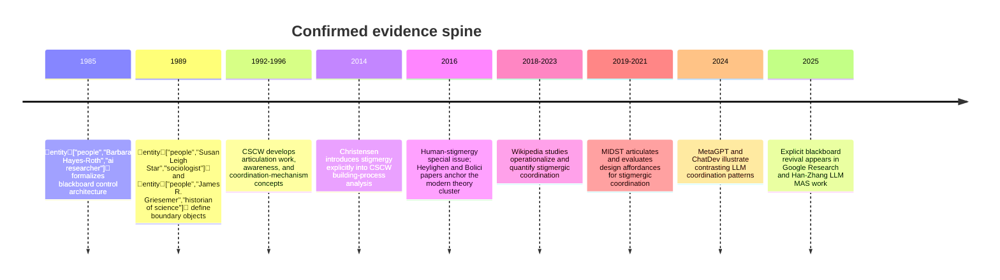
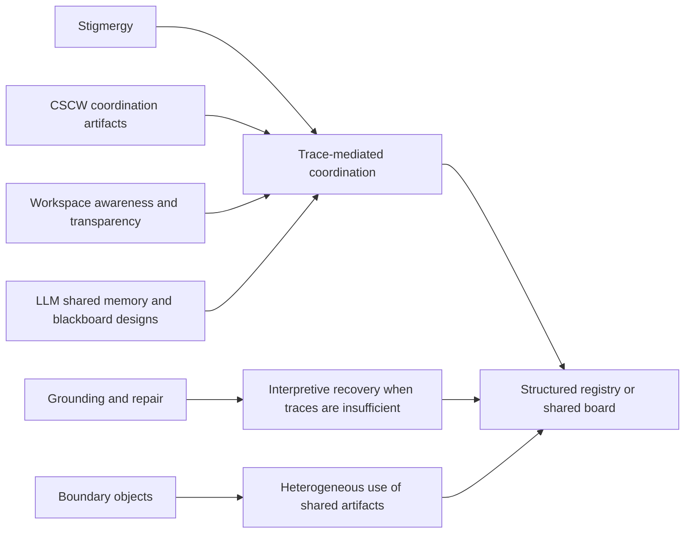

# Synthesis of Two Source Reviews on Stigmergic Coordination

## Scope and method

This analysis treats the two uploaded documents as **secondary review sources**, then checks their substantive claims against **primary or official materials** wherever possible. For clarity, the uploaded review titled *Stigmergic Coordination Among Heterogeneous AI Agents* is treated as **Doc A**, and *Stigmergic Coordination in Contemporary AI, HCI, and CSCW* is treated as **Doc B**. fileciteturn0file0 fileciteturn0file1

Because both documents are argumentative literature reviews rather than raw datasets, the comparison below normalizes **non-redundant substantive claims, bibliographic assertions, and explicit data points** instead of counting every rhetorical sentence. Doc B also contains inline web-citation markers from an earlier browsing session; those embedded markers were treated only as leads, and the named works were independently re-checked against publisher pages, official project pages, or accessible primary PDFs for this report. fileciteturn0file1

Claim statuses are used exactly as requested: **A** = replicated by both source documents and supported by primary evidence; **B** = contradicted and excluded from the final synthesis; **C** = plausible but not sufficiently verified; **D** = unique to one source document but corroborated by primary evidence.

## Executive summary

The two source documents converge strongly on the **core evidentiary spine** of the topic. Both correctly center contemporary stigmergy research on the 2016 *Cognitive Systems Research* cluster around entity["people","Francis Heylighen","systems theorist"] and on later empirical work around FLOSS, entity["organization","Wikipedia","online encyclopedia"], and the MIDST system associated with entity["people","Kevin Crowston","information scientist"] and collaborators. Primary sources confirm the main factual content of that backbone: Heylighen’s 2016 definition and taxonomy of stigmergy, Bolici–Howison–Crowston’s argument that FLOSS coordination cannot be captured by a simple explicit/implicit split, the MIDST affordance framework, and the later Wikipedia and MIDST empirical studies. citeturn17search1turn17search3turn29search2turn27view0turn23view0turn4view0turn7view0

The clearest factual error is a **bibliographic contradiction in Doc A**. Doc A attributes the 2023 *Journal of Management Information Systems* article *Stigmergy in Open Collaboration: An Empirical Investigation Based on Wikipedia* to Rezgui and Crowston, but the primary source shows that the article is by **Lei Zheng, Feng Mai, Bei Yan, and Jeffrey V. Nickerson**. This is a genuine contradiction of authorship metadata, not just a stylistic difference, and should be corrected before the document is reused. fileciteturn0file0 citeturn23view0turn6search6

Both documents also converge on a second major conclusion: modern LLM multi-agent work is indeed rediscovering **blackboard-like** or **shared-medium** coordination, even when the preferred vocabulary shifts to “shared message pool,” “shared memory,” or “blackboard architecture.” That claim is supported by primary sources on MetaGPT, ChatDev, the 2025 Google Research blackboard paper, and the 2025 arXiv blackboard-architecture paper by Han and Zhang. citeturn15view0turn13view3turn13view1turn14view0

Where the two documents differ, the differences are mostly **interpretive rather than factual**. Doc B adds a strongly corroborated CSCW/HCI layer around passive workspace awareness and transparency. Doc A adds a strongly corroborated CSCW linkage through entity["people","Lars Rune Christensen","cscw researcher"]’s 2014 building-process paper. The claims that still need further checking are not the core historical and empirical claims; they are the **meta-claims** about which framework is “best,” how narrow the stigmergy-labeled literature is relative to adjacent CSCW work, and whether recent product/protocol examples such as Google’s A2A or entity["company","Anthropic","ai company"]’s Claude tooling truly instantiate the specific shared-task-list semantics asserted in Doc A. citeturn16search7turn10view0turn10view1turn30search0turn30search4

Across 19 normalized claims, this review classified **11 as A**, **1 as B**, **4 as C**, and **3 as D**.

The historical progression confirmed by primary sources is summarized below. citeturn16search4turn21search0turn21search2turn16search7turn17search1turn23view0turn4view0turn7view0turn15view0turn13view1turn14view0

## Comparison matrix

**Source key:** A = Doc A; B = Doc B.  
**Decision rule:** Claims in class **B** are excluded from the synthesized narrative; claims in class **C** are kept separate and not treated as agreed findings.

| Claim or datum | Source(s) | Primary / official cross-check | Status | Recommended action |
|---|---|---|---|---|
| The 2016 *Cognitive Systems Research* issue on human stigmergy was a major focal point for modern human-domain stigmergy work. | A, B | The issue opens with the editorial *Human stigmergy: Theoretical developments and new directions* and contains the Heylighen and Bolici papers that both documents rely on. citeturn17search1turn17search3turn17search8 | A | Keep. |
| Heylighen 2016a defines stigmergy as indirect coordination in which a trace left in a medium stimulates subsequent action. | A, B | Elsevier’s official abstract states exactly this definition and lists the conceptual components analyzed in the paper. citeturn17search3turn3search0 | A | Keep. |
| Heylighen 2016a/2016b generalize stigmergy beyond insects, distinguish varieties, and connect cognition to “individual stigmergy.” | A, B | The publisher page for Part II identifies “varieties and evolution,” including “individual vs. collective stigmergy,” and an official abstract excerpt states that cognition can be seen as an interiorization of individual stigmergy. citeturn29search2turn29search1turn29search7 | A | Keep, but cite Part II explicitly when invoking cognition. |
| Bolici, Howison, and Crowston argue that a simple explicit/implicit split is inadequate for FLOSS coordination and that the codebase itself helps manage dependencies. | A, B | The accessible primary PDF states that the explicit/implicit distinction has limitations in FLOSS and that the work product itself and the way it is shared play an underappreciated coordinating role. citeturn27view0 | A | Keep. |
| Christensen 2014 introduces stigmergy to CSCW and explicitly delimits it relative to articulation work and awareness. | A | The article description on official/repository pages says it seeks to introduce stigmergy to CSCW and delimit it against articulation work and awareness. citeturn16search7turn9search3 | D | Keep as a unique corroborated contribution from Doc A. |
| Rezgui and Crowston 2018 provide evidence of stigmergic coordination in Wikipedia by showing that a majority of edits in sample articles are not associated with Talk-page discussion. | A, B | The OpenSym abstract states that the majority of edits to two example articles were not associated with Talk-page discussion, suggesting possible stigmergic coordination. citeturn6search9turn6search13 | A | Keep. |
| The 2023 JMIS article finds two intertwined processes of stigmergy—collective modification and collective excitation—and reports positive associations with participation and quality. | A, B | The JMIS abstract explicitly states both processes and reports that the degree of stigmergy is positively associated with participation and knowledge quality. citeturn23view0 | A | Keep. |
| **Doc A** correctly attributes the 2023 JMIS article to Rezgui and Crowston. | A | The primary JMIS record names Lei Zheng, Feng Mai, Bei Yan, and Jeffrey V. Nickerson as the authors. fileciteturn0file0 citeturn23view0turn6search6 | B | **Correct the citation and remove the mistaken attribution from any synthesis.** |
| MIDST’s design framework centers on visibility, combinability, and either “defined genres” or “legibility” as the core affordances for stigmergic coordination. | A, B | The 2019 MIDST paper names visibility, combinability, and defined genres; the 2021 evaluation paper operationalizes the related requirement as visibility, legibility, and combinability, with legibility tied to recognizable genre. citeturn4view0turn7view0 | A | Keep, but normalize terminology as “visibility, interpretability/legibility, combinability.” |
| The 2021 MIDST evaluation covered 40 student teams, 24 using MIDST, found evidence of partial stigmergic coordination and better project performance, but also uneven adoption. | A, B | The 2021 primary PDF states “a total of 40 student teams (24 using MIDST),” says MIDST teams seemed to coordinate at least in part stigmergically and performed better, and later notes that not all MIDST teams used the collaboration features as intended. citeturn7view0 | A | Keep, with the adoption caveat. |
| CSCW and HCI evidence shows that passive/workspace-based awareness and artifact transparency support coordination, but direct communication still matters when transparency is insufficient. | B | entity["people","Paul Dourish","hci researcher"] and entity["people","Victoria Bellotti","researcher"] argue for awareness information passively provided through the shared workspace; work on entity["company","GitHub","developer platform"] shows rich coordination from transparency; Kittur–Kraut and Crowston–Rezgui show explicit coordination still matters in some cases. citeturn10view0turn10view1turn31search2turn25search3 | D | Keep as a unique corroborated expansion from Doc B. |
| Current LLM multi-agent systems split into at least two coordination families: shared-board/message-pool systems and dialogue-first systems. | B | MetaGPT’s primary text describes a shared message pool and publish-subscribe communication through structured outputs, while ChatDev’s ACL paper describes a chat-powered framework coordinated through chat chains and multi-turn dialogue. citeturn15view0turn13view3 | D | Keep as a unique corroborated comparative claim from Doc B. |
| Modern LLM research is reviving blackboard-style coordination, often under newer labels such as shared message pool or shared memory. | A, B | MetaGPT uses a global/shared message pool; Google Research explicitly frames its 2025 system as blackboard-inspired; Han and Zhang explicitly reintroduce blackboard architecture for LLM MAS. citeturn15view0turn13view1turn14view0 | A | Keep. |
| Google Research’s 2025 blackboard paper reports 13%–57% relative improvement in end-to-end task success over baselines for data-science information discovery. | A, B | The official Google Research abstract reports 13%–57% relative improvement and explains the architecture’s key mechanism. citeturn13view1 | A | Keep, with the note that this is recent research and not yet a long-settled result. |
| Han and Zhang’s 2025 blackboard-architecture paper claims competitive performance with lower token use and action selection based on blackboard state until consensus is reached. | A, B | The arXiv abstract states that agents share information via a blackboard, that action selection depends on blackboard content, that rounds repeat until consensus, and that the system is competitive while spending fewer tokens. citeturn14view0turn14view3 | A | Keep, but label it as preprint evidence. |
| The strongest 2026 theoretical position is a hybrid framework combining stigmergy with coordination artifacts, grounding, distributed cognition, and boundary objects. | A, B | The ingredients are individually well-supported in primary sources, but the claim that this is the **best** or most defensible synthesis is an interpretive conclusion made by the review authors rather than an established consensus in a primary source. citeturn21search0turn21search2turn10view0turn18search8 | C | Treat as a reasoned proposal, not as a settled finding. |
| The explicitly stigmergy-labeled literature since 2015 is narrow relative to the larger CSCW/HCI literature studying related phenomena under other names. | A, B | The claim is plausible and consistent with the source map, but it really requires bibliometric or systematic-review evidence rather than selected exemplars alone. citeturn17search1turn27view0turn4view0turn10view0turn10view1 | C | Verify through a scoping review or citation analysis before presenting as a quantitative literature judgment. |
| Google’s A2A protocol and Anthropic/Claude tooling already instantiate a shared task list with “claim semantics” comparable to a kanban registry. | A | Official Google A2A materials confirm interoperable agent communication, coordination, and cross-vendor collaboration, but the stronger shared-task-list/claim-semantics formulation is not established in the official sources reviewed here; no equally specific official Anthropic source was located in this pass. fileciteturn0file0 citeturn30search0turn30search4turn30search10 | C | Verify directly against current product docs, demos, or repositories before reuse. |
| Boundary objects are the single most important framework for the heterogeneity problem. | A | The original paper defines boundary objects as artifacts that are adaptable to different viewpoints yet robust enough to maintain identity across them. That supports relevance, but not the superlative ranking. citeturn21search0 | C | Downgrade to “a strong candidate framework” unless comparative theoretical evidence is added. |

## Synthesized agreed findings

Once the contradicted bibliographic claim is removed, the two documents agree on a coherent and well-supported historical story. Modern human-domain stigmergy research is anchored in the 2016 special issue that generalized the concept beyond insect coordination, especially through Heylighen’s definition-and-taxonomy papers and Bolici–Howison–Crowston’s bridge from organizational coordination theory to software work. That part of both reviews is solid. citeturn17search1turn17search3turn29search2turn27view0

The strongest replicated empirical evidence concerns **artifact-mediated work in digital collaboration**. In FLOSS, the codebase is not just the output of work but part of the coordinating medium. In Wikipedia, edits to the shared artifact cluster in ways consistent with stigmergic coordination, yet article-quality work also shows that explicit coordination is still sometimes consequential. In MIDST, the practical design lesson is not merely “leave traces,” but “leave traces that are visible, interpretable, and combinable.” citeturn27view0turn6search9turn23view0turn25search3turn4view0turn7view0

Doc B’s best unique contribution is that it sharpens the adjacent CSCW/HCI evidence about **why** traces sometimes work and sometimes fail. The workspace-awareness literature shows that passive cues embedded in the shared workspace can support fluid coordination. Transparency studies in GitHub show that people infer goals, viability, competence, and commitment from activity traces. But those same literatures also imply limits: when the traces are incomplete, ambiguous, or insufficient for negotiation, direct communication re-enters. In other words, the best corroborated synthesis is **not** that artifacts replace communication; it is that artifacts can carry a substantial share of the coordination load until the boundary conditions of legibility are reached. citeturn10view0turn10view1turn31search2turn25search3

The LLM-agent evidence fits this pattern more closely than either source document sometimes suggests. Shared-medium systems are real: MetaGPT’s shared message pool is explicitly global and publish-subscribe, Google Research explicitly frames its 2025 data-science system as blackboard-inspired, and Han–Zhang explicitly build an LLM MAS around blackboard state and consensus rounds. At the same time, dialogue-centric systems such as ChatDev are also real and successful. The modern landscape is therefore better described as a **family of coordination architectures** than as a single blackboard consensus. citeturn15view0turn13view1turn14view0turn13view3

The synthesis supported by the agreed findings is therefore narrower and more rigorous than either document’s strongest theoretical flourish: a shared registry or board can plausibly support stigmergic coordination among heterogeneous AI agents **when it functions as a coordination artifact whose traces are visible, interpretable, typed enough to combine, and backed by repair channels when interpretation diverges**. That conclusion is supported jointly by the MIDST affordance work, passive-awareness research, transparency research, and the contrast between shared-message-pool and dialogue-first LLM systems. citeturn4view0turn7view0turn10view0turn10view1turn15view0turn13view3

The agreed relationship among these literatures is summarized below. citeturn21search2turn21search0turn10view0turn15view0turn13view1

## Must be verified

| Claim needing further verification | Priority | Why it remains unresolved | Suggested verification step |
|---|---|---|---|
| The stigmergy-labeled post-2015 literature is *small* relative to adjacent CSCW/HCI work under other labels. | High | This is plausible, but it is a literature-scope judgment that cannot be established rigorously from selected examples alone. | Run a scoping review or bibliometric query across keywords such as *stigmergy*, *workspace awareness*, *transparency*, *articulation work*, *coordination mechanism*, *boundary objects*, and *trace ethnography* from 2015–2026. |
| The hybrid theory proposed by the two documents is the *strongest* or *most defensible* 2026 framework. | Medium | The ingredients are credible, but “best fit” is a comparative theoretical claim rather than a directly observed finding. | Conduct a formal comparative framework review: evaluate explanatory coverage of stigmergy, coordination mechanisms, boundary objects, grounding, and distributed cognition against the exact target case of heterogeneous human–AI registry coordination. |
| Boundary objects are the most important lens for heterogeneity. | Medium | The original boundary-object paper strongly supports relevance, but not primacy over other frameworks. | Compare boundary objects against ad hoc teamwork, shared mental models, and human–agent teaming frameworks using explicit evaluation criteria. |
| Google A2A and Anthropic/Claude tooling instantiate a shared task list with “claim semantics.” | High | Official Google materials confirm interoperable agent communication but not the stronger claim-semantic/task-list characterization; a matching primary Anthropic source was not established here. | Check current official docs, demos, repos, or product guides for task-state schemas, claims, subscriptions, ownership, or status-transition semantics. |
| Several adjacent works named in Doc A and Doc B but not load-bearing in the final synthesis may still matter for a full dissertation-grade literature map. | Medium | This report prioritized the claims that actually drive the synthesis. | Verify the remaining extracted references individually, especially works on ad hoc teamwork, human–agent teaming, and recent multi-agent memory systems. |

## Appendices

### Source documents

**Doc A:** *Stigmergic Coordination Among Heterogeneous AI Agents*. fileciteturn0file0  
**Doc B:** *Stigmergic Coordination in Contemporary AI, HCI, and CSCW*. fileciteturn0file1

### Core extracted citations and primary links used in this synthesis

The following extracted references were checked directly against primary or official sources in this pass:

- entity["people","Francis Heylighen","systems theorist"], *Stigmergy as a universal coordination mechanism I: Definition and components* (2016). Primary source: Elsevier/official abstract. citeturn17search3turn3search0  
- Heylighen, *Stigmergy as a universal coordination mechanism II: Varieties and evolution* (2016). Primary source: Elsevier/official abstract metadata and excerpt. citeturn29search2turn29search1  
- Bolici, Howison, and Crowston, *Stigmergic coordination in FLOSS development teams* (2016). Primary source: accessible author-hosted PDF. citeturn27view0  
- entity["people","Lars Rune Christensen","cscw researcher"], *Practices of Stigmergy in the Building Process* (2014). Primary source: Springer and EUSSET repository metadata/description. citeturn16search7turn9search3  
- Rezgui and Crowston, *Stigmergic Coordination in Wikipedia* (2018). Primary source: OpenSym/ACM abstracts. citeturn6search9turn6search13  
- Zheng, Mai, Yan, and Nickerson, *Stigmergy in Open Collaboration* (2023). Primary source: JMIS page and institutional publication record. citeturn23view0turn6search6  
- Crowston et al., *Socio-technical Affordances for Stigmergic Coordination Implemented in MIDST* (2019). Primary source: accessible ACM-author PDF. citeturn4view0  
- Crowston et al., *Evaluating MIDST, A System to Support Stigmergic Team Coordination* (2021). Primary source: accessible ACM-author PDF. citeturn7view0  
- entity["people","Paul Dourish","hci researcher"] and entity["people","Victoria Bellotti","researcher"], *Awareness and Coordination in Shared Workspaces* (1992). Primary source: accessible PDF. citeturn10view0  
- Dabbish, Stuart, Tsay, and Herbsleb, *Social Coding in GitHub* (2012). Primary source: accessible PDF. citeturn10view1  
- entity["people","Barbara Hayes-Roth","ai researcher"], *A Blackboard Architecture for Control* (1985). Primary source: Elsevier abstract page. citeturn16search4  
- MetaGPT (ICLR 2024). Primary sources: entity["organization","OpenReview","research platform"] page and accessible HTML/PDF text showing shared message pool and publish-subscribe communication. citeturn13view0turn15view0  
- ChatDev (ACL 2024). Primary source: entity["organization","ACL Anthology","research archive"] page showing chat-chain/dialogue-centered architecture. citeturn13view3  
- Google Research, *Blackboard Multi-Agent Systems for Information Discovery in Data Science* (2025). Primary source: official Google Research page. citeturn13view1  
- Han and Zhang, *Exploring Advanced LLM Multi-Agent Systems Based on Blackboard Architecture* (2025). Primary source: arXiv abstract page. citeturn14view0  
- entity["people","Susan Leigh Star","sociologist"] and entity["people","James R. Griesemer","historian of science"], *Institutional Ecology, “Translations,” and Boundary Objects* (1989). Primary source: journal abstract page. citeturn21search0  
- entity["people","Herbert H. Clark","psycholinguist"] and entity["people","Susan E. Brennan","psychologist"], *Grounding in Communication* (1991). Primary-source access was partial in this pass; the existence and bibliographic details are confirmed by official author and archival pages, but line-level extraction from the chapter text was limited. citeturn18search8turn18search9  
- entity["people","Edwin Hutchins","anthropologist"], *Cognition in the Wild* (1995). Used here as a theoretical ingredient named in both reviews, but not as a primary empirical adjudicator for the core claim matrix. citeturn18search7  
- Google’s A2A materials. Primary sources: official Google developer and open-source blog posts on A2A announcement and governance transfer. citeturn30search0turn30search10

### Additional extracted references from the two documents not decisive in the final synthesis

The source documents also extract or mention a wider set of adjacent works that were not load-bearing for the final agreed narrative, including works by Schmidt and Bannon; Schmidt and Simone; Schmidt and Wagner; Cabitza and Simone; Kittur and Kraut; Geiger and Ribes; Klein, Feltovich, Bradshaw, and Woods; Lee on boundary-negotiating artifacts; Ricci, Omicini, and Viroli on cognitive stigmergy; Mirsky et al. on ad hoc teamwork; Schneider et al. on human–agent coordination; and several newer multi-agent memory and orchestration references. Those citations were preserved in the extraction pass from the source documents, but not all were individually adjudicated as load-bearing claims for this report. fileciteturn0file0 fileciteturn0file1