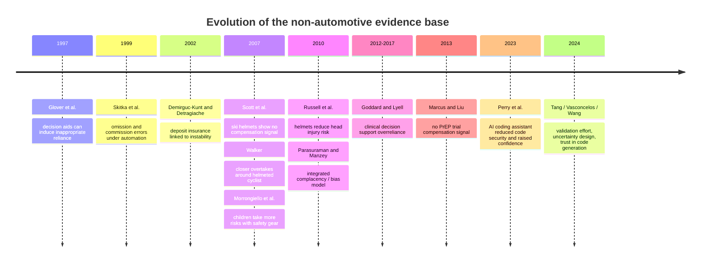

# Synthesis of Two Uploaded Reviews on Risk Compensation Outside Automotive Safety

## Executive Summary

The two uploaded documents are useful but not equivalent. **Source A** is the longer and more systematic review, with explicit confidence flags, a broader sweep across sports, finance, HIV prevention, and automation, and clearer study-design recommendations. **Source B** is shorter, more synthetic, and often sharper on the knowledge-work framing, but it also contains at least two material claims that do not hold up against the underlying papers. fileciteturn0file0 fileciteturn0file1 citeturn18view0turn18view3

The strongest common conclusion is that **strong-form risk homeostasis**—the idea that safety gains are fully behaviorally offset—is not a good empirical baseline. The better-supported position is **partial offset**: safety interventions usually still help, but some of their benefits can be eroded when incentives change or when people verify less. The most convincing non-automotive evidence for that partial-offset view comes from banking safety nets and from automation-bias / complacency studies, not from the classical helmet literature alone. fileciteturn0file0 fileciteturn0file1 citeturn9view0turn1view3turn7search5turn9view3turn6view0

Where the two sources most clearly agree, and where primary literature supports them, is on five propositions. First, ski and snowboard helmets reduce head injury risk and do **not** show convincing evidence of compensatory risk-taking overall. Second, deposit insurance and related safety nets can induce risk-shifting in normal times, especially when supervision is weak, although crisis-period effects are more nuanced. Third, decision aids and clinical support tools can create omission and commission errors by reducing checking. Fourth, the nearest analogue to supervising AI coding agents is **automation bias / complacency**, not classical road-safety theory by itself. Fifth, a credible study in AI-assisted work must measure vigilance directly, manipulate reliability or perceived reliability rather than just tool access, and run long enough for reliance to habituate. citeturn14search5turn14search0turn1view3turn6view2turn9view3turn3view3turn21view0

The main corrections are straightforward. **Source B** says that the Tang eye-tracking study involved **nine programmers**, but the paper’s abstract reports **28 participants**. It also says that the Alon-Barkat and Busuioc public-sector experiments found **overreliance on algorithmic advice**, but the article reports **no overall automation bias** across its three studies; what it does find is stereotype-linked **selective adherence** in one experimental setting. Those two claims should be excluded from any merged synthesis. fileciteturn0file1 citeturn18view0turn18view3

A final caution concerns ranking claims such as “the five most-cited empirical tests.” The two sources present incompatible top-five lists, and neither provides a reproducible citation-count protocol that would let another researcher verify the ranking exactly. Those ranking claims should not be treated as findings; they are better understood as **editorial selections under different scope rules**. fileciteturn0file0 fileciteturn0file1

## Claim Comparison

For reference, **Source A** is the uploaded *Risk Compensation Outside Automotive Safety: A Focused Literature Review*, and **Source B** is the uploaded *Risk Compensation Outside Automotive Safety*. fileciteturn0file0 fileciteturn0file1

| Claim or theme | Source A | Source B | Replication status | External adjudication |
|---|---|---|---|---|
| Full homeostasis is rejected; partial compensation is the better empirical prior | Explicit and central. fileciteturn0file0 | Explicit and central. fileciteturn0file1 | **Replicated** | Consistent with Barry Pless’s rebuttal commentary and with modern automation / finance evidence. citeturn9view0turn9view3turn1view3 |
| Financial safety nets create partial offset via moral hazard / risk-shifting | Uses Demirgüç-Kunt–Detragiache and Anginer et al. as core evidence. fileciteturn0file0 | Uses Hovakimian and Ioannidou–Penas as core evidence. fileciteturn0file1 | **Replicated with different anchor papers** | Strongly supported. Deposit insurance is linked to higher crisis risk cross-nationally, and the Bolivian quasi-natural experiment shows riskier lending after introduction of explicit insurance. citeturn1view3turn6view2turn7search4turn7search5 |
| Ski / snowboard helmets reduce head injury without convincing compensation | Russell meta-analysis and Scott field study emphasized. fileciteturn0file0 | Scott study emphasized as a negative or reverse-offset test. fileciteturn0file1 | **Replicated** | Supported. The meta-analysis reports pooled OR 0.65 for head injury, while Scott et al. found helmet wearers reported slower speed and less challenge. citeturn14search5turn14search0 |
| Automation bias / complacency is the closest analogue to AI coding supervision | Explicit. fileciteturn0file0 | Explicit. fileciteturn0file1 | **Replicated** | Strongly supported by Parasuraman–Manzey, Bahner, Skitka, Goddard, and Lyell. citeturn9view3turn3view3turn6view0turn15search1turn2search3 |
| Good study design requires unit-level / process-level measures, not aggregate trends alone | Explicit. fileciteturn0file0 | Explicit. fileciteturn0file1 | **Replicated** | Supported by methodological arguments in Hedlund, Underhill, and the direct-verification design in Bahner. citeturn24search4turn19search0turn3view3 |
| Reliability or perceived reliability should be manipulated, not just tool access | Explicit within-subject reliability framing. fileciteturn0file0 | Explicit “randomize reliability, not just access” framing. fileciteturn0file1 | **Replicated** | Consistent with automation-bias literature and with the logic of causal identification in decision-aid studies. citeturn9view3turn3view3turn24search4 |
| Perry et al. shows AI-assisted programmers write less secure code and become more confident | Explicit. fileciteturn0file0 | Not a core empirical anchor, but consistent with B’s broader knowledge-work framing. fileciteturn0file1 | **Unique to A, externally supported** | Supported. The paper reports 47 participants, less secure output with AI access, and greater belief that insecure solutions were secure. citeturn21view0 |
| Walker 2007 found helmeted cyclists were passed more closely | Explicit. fileciteturn0file0 | Not central. fileciteturn0file1 | **Unique to A** | The original study reports the effect, and later re-analysis disputes whether it implies more *close passes*; the 2019 systematic review finds little to no overall support for bicycle-helmet risk compensation. citeturn20search19turn13search3turn9view2 |
| iPrEx / related PrEP trials found no risk compensation, but placebo trials are weak tests of compensation | Explicit. fileciteturn0file0 | Not central. fileciteturn0file1 | **Unique to A, externally supported** | Supported. Marcus et al. reported no evidence of sexual risk compensation in iPrEx, and Underhill argues that rigorous identification should focus on perceived risk reduction and ethically defensible designs. citeturn4view0turn24search4turn12search0 |
| Tang et al. studied **nine** programmers | Absent. fileciteturn0file0 | Explicit. fileciteturn0file1 | **Contradicted** | False as stated. The arXiv abstract reports **28 participants**. citeturn18view0 |
| Alon-Barkat and Busuioc found overreliance / automation bias in public-sector decision making | Absent. fileciteturn0file0 | Explicit. fileciteturn0file1 | **Contradicted** | False as stated. Their abstract reports **no evidence for overall automation bias** across the three studies; the more robust positive finding is selective adherence aligned with stereotypes. citeturn18view3 |
| “Top five most-cited empirical tests” | Source A offers one list. fileciteturn0file0 | Source B offers a different list. fileciteturn0file1 | **Unreplicated** | Do not synthesize as fact. The lists conflict and neither source provides a reproducible bibliometric protocol. |

## Synthesized Narrative of Agreed Findings

The agreed and externally supported narrative is not that safety interventions fail. It is that **their effects are filtered through behavior**, and the net outcome depends on how visible the protection is, what incentives it changes, how costly verification is, and how much latitude users have to alter their behavior. That is the unifying thread that lets the finance and automation literatures speak to the AI-coding-supervision problem more convincingly than a literal transposition of road-safety theory would. fileciteturn0file0 fileciteturn0file1 citeturn19search0turn9view3turn24search4

In **protective-equipment settings**, the most defensible summary is mixed but mostly skeptical of large compensation effects. Ski and snowboard helmets reduce head injury risk, and the better field and review evidence does not show those gains being erased by riskier behavior. Scott et al. report lower self-reported speed and lower challenge among helmet wearers, and Russell et al.’s meta-analysis found clear protective benefit with no compelling offset signal. In cycling, Walker’s overtaking study remains a real and influential result, but later re-analysis and the 2019 systematic review mean it should be treated as a **contested single-study finding**, not as a domain-level conclusion that helmets reliably induce more risk. citeturn14search0turn14search5turn20search19turn13search3turn9view2

In **financial regulation**, both reviews are aligned and the primary literature supports them strongly. Deposit insurance is a good analogue for partial risk compensation because it visibly changes downside exposure and weakens monitoring incentives. Demirgüç-Kunt and Detragiache find that explicit deposit insurance increased the likelihood of banking crises in their 61-country panel, especially where institutional conditions were weak. Ioannidou and Penas then provide sharper causal leverage in Bolivia, showing that after explicit deposit insurance was introduced, banks initiated riskier loans that carried higher rates and performed worse ex post. Anginer and coauthors add the necessary nuance: the moral-hazard effect appears stronger in normal times, while crisis periods can reveal a stabilizing effect. This is the clearest domain in which both source documents converge on a genuine **partial-offset** mechanism. citeturn1view3turn6view2turn7search5turn7search4turn7search9

In **biomedical HIV prevention**, Source A is more useful than Source B because it engages directly with the core methodological problem. Marcus et al. report no evidence of sexual risk compensation in the iPrEx trial, and Liu et al. also report decreases in self-reported risk behavior in a U.S. PrEP trial. But the stronger conceptual point is Underhill’s: risk compensation is a response to **perceived** risk reduction, so placebo-controlled trials are often weak tests of the mechanism even when they are strong trials for efficacy. For synthesis purposes, the correct conclusion is not “PrEP disproves risk compensation.” It is “early trial evidence did not show offset, and future identification requires designs that better capture perceived protection and user-level behavior.” citeturn4view0turn12search0turn24search4turn26search1

In **automation and information work**, the shared core is especially strong. Skitka shows that a very reliable but imperfect aid can worsen monitoring, creating both omission and commission errors. Bahner shows that reduced verification can be observed directly through information sampling, and that exposure to automation failures can attenuate but not eliminate complacency. Parasuraman and Manzey synthesize this literature into an attentional model in which complacency and automation bias are overlapping manifestations of the same broader human–automation problem. Goddard’s review and later empirical work in clinical decision support show that these problems survive domain transfer into medicine, and Lyell’s prescribing studies reinforce that incorrect support can actively introduce errors by reducing checking. This is the strongest bridge from non-automotive risk compensation to AI-assisted knowledge work. citeturn6view0turn3view3turn9view3turn15search1turn15search2turn2search3

That bridge becomes even tighter in **AI-assisted software development**. Perry et al. show that giving developers access to an AI assistant can make code less secure while simultaneously increasing confidence in its security. Tang and colleagues show that validation and repair of LLM-generated code consume real cognitive effort and take multiple forms that can be observed through IDE traces and eye tracking. Vasconcelos and colleagues show that interface design matters: highlighting tokens by predicted edit likelihood improved task completion and led to more targeted edits, while raw generation-probability highlighting did not help. Wang and colleagues show, through interviews, that appropriate trust depends on expectation-setting, configurability, and support for validation. Put together, these studies support the shared conclusion of both uploaded documents: **the margin of compensation in knowledge work is often verification effort**. citeturn21view0turn18view0turn18view1turn17search5

The common methodological implication follows directly. A good field study of human supervision over AI coding agents should not ask only whether outcomes are better or worse with AI. It should ask **how reliability changes verification behavior**. That means manipulating actual or perceived reliability, measuring review behavior directly, avoiding naïve user-versus-non-user comparisons, and running the study over repeated exposure rather than a single short session. On that point, both sources are right, and the primary literature they draw on is strong enough to support a unified recommendation. fileciteturn0file0 fileciteturn0file1 citeturn24search4turn3view3turn9view3turn21view0turn18view0

The evidence trajectory can be summarized as follows. citeturn6view1turn6view0turn1view3turn14search0turn14search5turn9view3turn4view0turn21view0turn18view0turn18view1

## Excluded Claims and Corrections

| Excluded claim | Source | Reason for exclusion | Evidence |
|---|---|---|---|
| Tang et al. studied **nine** programmers validating and repairing Copilot-generated code | Source B fileciteturn0file1 | The primary paper reports **28 participants**, so the sample-size statement is false as written | Tang et al. abstract: “a lab study with 28 participants.” citeturn18view0 |
| Alon-Barkat and Busuioc found overreliance on algorithmic advice even in the face of warning signals | Source B fileciteturn0file1 | The article reports **no overall automation bias** across all three studies; its positive result is stereotype-linked selective adherence in one setting | Abstract and discussion sections explicitly say they do not find support for automation bias overall. citeturn18view3 |
| Either document’s “top five most-cited empirical tests” should be treated as a factual ranking | Both sources fileciteturn0file0 fileciteturn0file1 | The lists conflict and no reproducible citation-count method is supplied; this is an editorial selection, not a validated empirical result | The two uploaded rankings are incompatible and unsupported by a fixed bibliometric protocol |
| Walker 2007 should be generalized as settled proof that bicycle helmets produce risk compensation | Source A leans toward this study as an anchor; Source B deemphasizes it fileciteturn0file0 fileciteturn0file1 | The original effect exists, but later re-analysis and a systematic review show the domain-level claim is not replicated | Original paper and 2019 response confirm the original average-distance effect; Olivier and Walter dispute its close-pass interpretation, and Esmaeilikia et al. find little to no overall support. citeturn20search19turn20search1turn13search3turn9view2 |

## Must Verify

| Claim needing further verification | Why it remains unresolved | Recommended verification method | Priority sources |
|---|---|---|---|
| Exact “most-cited” ranking of non-automotive empirical tests | The two source lists conflict, and citation counts vary by index, date, and inclusion rules | Run a reproducible bibliometric query with a frozen date, explicit inclusion criteria, and separate counts by database | OpenAlex, Scopus, Web of Science, Google Scholar |
| Detailed Lyell 2017 effect-size claims, especially the precise omission-error increases and the null workload effect | I confirmed the paper and its general topic, but not every numerical detail from the accessible primary abstract | Read the full BMC article and the 2018 *Human Factors* follow-up together, then extract the exact estimates and model specifications | BMC full text; *Human Factors* full text; PubMed |
| Source A’s claim that varying automation reliability over time is the “most robust mitigator” | Parasuraman’s abstract confirms the broader synthesis, but that exact ranking of mitigators was not fully recoverable from accessible abstracts | Check the full review and the specific cited mitigation experiments | *Human Factors* full text; cited underlying experiments |
| Source A’s claim that no published study explicitly frames AI coding-agent supervision as a risk-compensation problem | This is a negative claim about the entire literature and is difficult to prove exhaustively | Conduct a structured scoping search over titles, abstracts, and keywords for “risk compensation,” “automation bias,” “coding agents,” “code review,” and “software engineering” | ACM Digital Library, IEEE Xplore, arXiv, Scopus, Web of Science |
| Source B’s claims about Hampton, Seow, and Mălăescu effect details | I confirmed the papers exist and broadly match the themes, but not every specific directional claim from the original articles | Read the full papers and extract the exact task designs, interaction terms, and effect directions | ScienceDirect full text; DOI landing pages |
| Source B’s claim that occupational safety and cybersecurity remain thin direct literatures for Peltzman-style tests | Plausible, but this requires a systematic absence check rather than ad hoc confirmation | Run scoping searches with inclusion criteria for direct causal tests of vigilance offset from protective tools | Scopus, Web of Science, PubMed, IEEE Xplore, NIOSH / OSHA literature databases |
| Source A’s broader characterization that open-label PrEP studies show only minimal-to-modest compensation, mainly through condom use rather than partner counts | The iPrEx and related trial claims are well supported, but the broader demonstration-study summary should be checked against a systematic review | Review later systematic reviews or meta-analyses of PrEP implementation studies | *The Lancet HIV*, *Journal of the International AIDS Society*, PubMed, WHO technical reviews |

## Appendices

### Source Metadata

| Source | Metadata | Assessment |
|---|---|---|
| Source A | *Risk Compensation Outside Automotive Safety: A Focused Literature Review*; 243 lines; explicitly prepared as a study-design reference for human supervision of AI coding agents; includes confidence flags and a rejected-citations appendix. fileciteturn0file0 | Stronger as a structured review and methodological guide. Its main weakness is that some detailed claims extend beyond what was re-checkable from accessible primary abstracts in this session. |
| Source B | *Risk Compensation Outside Automotive Safety*; 81 lines; concise synthesis organized around “most-cited empirical tests,” knowledge work, gaps, and methodological recommendations. fileciteturn0file1 | Stronger as a compact synthesis of knowledge-work implications. Its main weakness is overcompression: at least two paper summaries are materially inaccurate, and some ranking claims are not reproducibly documented. |

### Extracted Claim-Level Evidence From Source A

The table below groups closely related sentences into single claim units when they refer to the same study or result. fileciteturn0file0

| A-ID | Claim extracted from Source A | Key data / citation embedded in source | Adjudication |
|---|---|---|---|
| A1 | Walker 2007 recorded 2,355 overtaking events and found drivers passed about 8.5 cm closer when the cyclist wore a helmet | Walker 2007; “about 8.5 cm closer” | **Confirmed as original study result, but later contested in interpretation.** citeturn20search19turn13search3turn9view2 |
| A2 | Later synthesis does not support Walker as a general bicycle-helmet compensation finding | Olivier and Walter 2013; Esmaeilikia et al. 2019 | **Confirmed.** citeturn13search3turn9view2 |
| A3 | Russell et al. meta-analysis found helmet use reduced head injury risk, pooled OR 0.65 (95% CI 0.55–0.79) | Russell et al. 2010 | **Confirmed.** citeturn14search5 |
| A4 | Scott et al. found helmet wearers reported slower speed (OR 0.64) and less challenge (OR 0.76) | Scott et al. 2007 | **Confirmed.** citeturn14search0turn14search4 |
| A5 | Demirgüç-Kunt and Detragiache found explicit deposit insurance increased banking-crisis likelihood, especially with weak institutions and generous coverage | 61 countries, 1980–1997 | **Confirmed.** citeturn1view3 |
| A6 | Anginer et al. found a state-dependent pattern: more risk in normal times, more stability in crises | Anginer et al. 2014 | **Confirmed.** citeturn7search5turn7search9 |
| A7 | Marcus et al. found no evidence of sexual risk compensation in iPrEx | iPrEx / PLOS ONE 2013 | **Confirmed.** citeturn4view0 |
| A8 | Placebo-controlled PrEP trials are weak tests of compensation because perceived protection is the operative mechanism | Methodological caveat tied to Underhill | **Confirmed.** citeturn24search4 |
| A9 | Morrongiello et al. found children had 51% more tripping / falling / bumping events while wearing protective gear | Accident Analysis & Prevention 2007 | **Confirmed.** citeturn14search2turn14search6 |
| A10 | Parasuraman and Manzey argue complacency arises under multitask load; automation bias causes omission and commission errors; simple practice or instructions are insufficient | *Human Factors* 2010 | **Mostly confirmed.** The broad synthesis is supported, though the exact ranking of mitigators was not fully rechecked. citeturn9view3 |
| A11 | Bahner et al. directly measured verification by information sampling and found exposure to automation failures reduced complacency | N=24 laboratory experiment | **Confirmed.** citeturn3view3 |
| A12 | Goddard review identified 74 included papers; later empirical work found 5.2% of correct prescribing decisions switched to incorrect after bad advice | JAMIA 2012; IJMI 2014 | **Confirmed.** citeturn15search1turn15search2 |
| A13 | Lyell et al. 2017 showed incorrect CDSS could increase omission and commission errors and that overall accuracy can worsen with imperfect aid quality | Controlled e-prescribing experiment | **Partially confirmed.** The general claim is well supported, but the exact percentages in Source A should still be checked from full text. citeturn2search3turn2search7turn8search2 |
| A14 | Perry et al. 2023 found AI-assisted participants wrote less secure code and were more confident it was secure | 47 participants, five tasks | **Confirmed.** citeturn21view0 |
| A15 | No published study explicitly frames AI coding-agent supervision as a risk-compensation problem | Negative literature claim | **Must verify.** |
| A16 | The consensus position is that full homeostasis is rejected, while partial compensation is sometimes observed | Section 3 synthesis | **Confirmed as a sound synthesis.** citeturn9view0turn1view3turn9view3 |
| A17 | Hedlund’s four conditions—visibility, motivation, control, opportunity—should be treated as diagnostics for new studies | Methodological recommendation | **Plausible and widely cited, but best verified from the full article before formal use as a preregistered framework.** citeturn11search3turn11search2 |

### Extracted Claim-Level Evidence From Source B

This appendix applies the same “claim unit” rule to the shorter source. fileciteturn0file1

| B-ID | Claim extracted from Source B | Key data / citation embedded in source | Adjudication |
|---|---|---|---|
| B1 | Skitka et al. is one of the most-cited verified empirical tests and shows omission / commission errors under automation | IJHCS 1999 | **Confirmed as a key study; ranking claim still unverified.** citeturn6view0 |
| B2 | Glover et al. shows decision aids can impair knowledge acquisition and induce inappropriate reliance | OBHDP 1997 | **Broadly confirmed.** The paper exists and squarely addresses those mechanisms. citeturn6view1 |
| B3 | Hovakimian et al. shows cross-country safety-net characteristics affect bank risk-shifting | JFSR 2003 | **Confirmed.** citeturn7search4turn7search12 |
| B4 | Ioannidou and Penas show riskier lending after explicit deposit insurance in Bolivia | JFI 2010 | **Confirmed.** citeturn6view2 |
| B5 | Scott et al. found no offset, possibly reverse offset, for ski helmets | Injury Prevention 2007 | **Confirmed.** citeturn14search0 |
| B6 | Occupational safety and cybersecurity are underrepresented as direct Peltzman-style literatures | Gap-analysis claim | **Must verify through systematic searching.** |
| B7 | Hampton shows reliance depends on user experience, task complexity, aid familiarity, and cognitive fit | Technology-dominance claim | **Plausible but needs full-text verification for exact directional wording.** citeturn16search1turn16search5 |
| B8 | Seow shows more restrictive decision aids reduce detection of non-prompted issues | Restrictiveness experiment | **Plausible but should be verified from full text before relying on exact effect description.** citeturn16search0turn16search8 |
| B9 | Mălăescu and Sutton show restrictive aids help novices more than experienced users | Heterogeneity claim | **Plausible but should be verified from full text before relying on the exact interaction.** citeturn16search2turn16search6 |
| B10 | Goddard and Lyell support the idea that verification difficulty is central to automation bias | Clinical decision-support synthesis | **Broadly confirmed, though the precise phrasing is a synthesis rather than a direct quote from one paper.** citeturn15search1turn15search2turn2search3 |
| B11 | Alon-Barkat and Busuioc found overreliance on algorithmic advice even with warning signals | Public-sector experiments | **Excluded as false.** Their paper reports no overall automation bias. citeturn18view3 |
| B12 | Tang et al. studied nine programmers | Eye-tracking / IDE study | **Excluded as false.** The abstract reports 28 participants. citeturn18view0 |
| B13 | Vasconcelos et al. found that predicted-edit-likelihood highlighting improved speed and edit targeting, while raw generation-probability highlighting did not help | 30 programmers | **Confirmed.** citeturn18view1 |
| B14 | Wang et al. found trust in AI code generation depends on expectation-setting, configuration, and support for validation | 17 developer interviews | **Confirmed.** citeturn17search5turn17search1 |
| B15 | Individual-level designs beat aggregate trend studies for identifying compensation | Methodological claim | **Confirmed as good methodological advice.** citeturn19search0turn24search4turn3view3 |
| B16 | The largest gap is software development with AI coding assistants and agents | Gap-rank claim | **Reasonable synthesis, but still partly inferential and not directly proven by one source.** citeturn21view0turn18view0turn18view1turn17search5 |

### Open Questions and Limits

This synthesis is strongest on the claims I could directly cross-check against accessible journal abstracts, open articles, or primary PDFs. It is weaker on claims that depended on inaccessible full text, on negative claims about the complete absence of a literature, and on exact bibliometric rankings. Those unresolved items are confined to the **Must Verify** section and have not been carried into the unified narrative as settled findings.