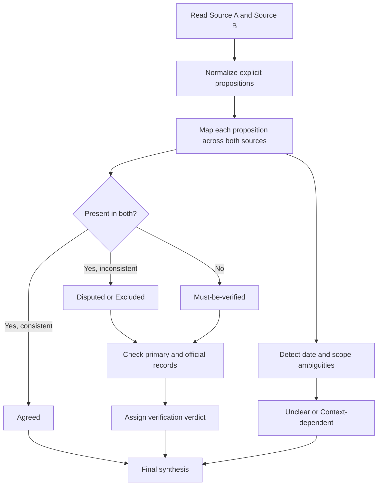

# Synthesis of the Two Uploaded Literature Scans on Ironies of Automation in AI Coding-Agent Supervision

## Executive summary

The two uploaded documents substantially converge on the same core thesis: Lisanne Bainbridge’s “ironies of automation” remain highly relevant to contemporary AI-assisted software work, especially where human labor shifts from direct production to supervision, verification, and exception handling. Both sources agree that the strongest bridge papers are Mica Endsley’s conceptual update for AI and Auste Simkute and colleagues’ productivity-loss synthesis for generative AI; both also agree that the software-engineering evidence is mixed, with early constrained-task speedups coexisting with slowdown, verification overhead, and review burdens in more realistic settings. Most importantly, both scans converge on the same gap claim: neither identifies a direct post-2020 empirical study of one human supervising multiple concurrent coding agents on a shared repository. fileciteturn0file0 fileciteturn0file1 citeturn0search1turn0search2turn1search0turn17view2

The two sources are not equally reliable in bibliographic detail. Source A is stronger on software-specific empirical literature and generally more precise about study substance, but it still contains at least one citation-level error: it gives the Bird et al. “Taking Flight with Copilot” DOI as `10.1145/3582083`, whereas the official DOI is `10.1145/3589996`. Source B is broader and useful for adjacent automation-bias literature, but it contains two clear bibliographic errors: it misattributes the 2025 *AI & Society* automation-bias review to “Vidoni et al.” instead of Giuseppe Romeo and Daniela Conti, and it misattributes “Human Factors Requirements for Human-AI Teaming in Aviation” to Stanton et al. in *Aerospace* instead of Barry Kirwan in *Future Transportation*. fileciteturn0file0 fileciteturn0file1 citeturn17view1turn6search0turn16search11

Using normalized propositions rather than sentence-by-sentence fragments, I classified 27 claims. Ten are **Agreed**, three are **Disputed/Excluded**, thirteen are **Must-be-verified** because they appear in only one source, and one is **Unclear/Context-dependent**. The encouraging result is that most of the single-source claims were externally verifiable using official publisher pages, preprint servers, PubMed, or organization-hosted records. The main unresolved item is the Imai (2022) Copilot-versus-human-pair-programming citation, which is repeatedly referenced by later papers but was not directly retrievable from an official ACM page in this search session. fileciteturn0file0 fileciteturn0file1 citeturn22search1turn22search2turn22search6

## Sources and method

I treat the uploaded “Focused Literature Scan on Ironies of Automation in AI Coding-Agent Supervision” as **Source A** and the uploaded “Ironies of Automation in AI/LLM Contexts: Literature Scan” as **Source B**. Both files are secondary synthesis documents rather than primary literature. Both are markdown artifacts and several long lines are visibly ellipsized, especially in Source A, so I normalized the explicit claims into semantically distinct propositions instead of pretending that every truncated line preserved full wording. fileciteturn0file0 fileciteturn0file1

For classification, I used the rubric you requested. **Agreed** means the proposition is present and materially consistent in both uploaded documents. **Disputed/Excluded** means a proposition in one source is contradicted by the other source or by a primary/official record. **Must-be-verified** means it appears in only one source and is not contradicted, but cross-source corroboration is absent. **Unclear/Context-dependent** means the apparent disagreement is explained by citation convention or scope, not by factual contradiction. Independent checks prioritized official publisher pages, arXiv or medRxiv records, PubMed, official organization pages, and the original user-provided source files. fileciteturn0file0 fileciteturn0file1 citeturn0search0turn0search1turn0search2turn17view1turn17view2turn19view0turn23search0

## Synthesis flowchart

## Detailed comparison table

| ID | Normalized claim | Source A location | Source B location | Classification | Evidence and reason for classification | Independent verification sources and verdict |
|---|---|---|---|---|---|---|
| C1 | Explicit Bainbridge-in-AI literature is still small, and software/coding-specific work is especially sparse. | Direct Bainbridge overview | Section 1 overview | Agreed | Both sources make the same qualitative scarcity claim. | Direct bridge corpus is indeed small in the verified set, but this remains a qualitative, search-scope-sensitive claim. citeturn0search0turn0search1turn0search2turn7search0 |
| C2 | Endsley 2023 is a direct AI-era extension of Bainbridge and is conceptual rather than empirical. | Endsley entry | Endsley entry | Agreed | Both sources describe the paper the same way. | Official *Ergonomics* record confirms a conceptual article presenting five “ironies of AI,” not an empirical experiment. Verified. citeturn0search2turn0search5 |
| C3 | Simkute et al. is a central bridge paper linking automation theory to GenAI productivity loss, including programming. | Simkute entry | Simkute entry | Agreed | Same substantive characterization in both scans. | Official journal record confirms the four productivity-loss mechanisms and the automation-literature framing. Verified. citeturn0search1turn0search8 |
| C4 | The Simkute paper should be cited as 2024 or 2025. | Simkute bibliographic line | Simkute bibliographic line | Unclear/Context-dependent | Source A uses online-first 2024 plus print-issue 2025; Source B uses 2025. | DOI record supports both conventions: online publication in 2024, volume/issue placement in 2025. Not a substantive contradiction. citeturn0search1turn0search8 |
| C5 | McCabe et al. 2024 is a direct, code-specific “ironies of programming automation” paper. | McCabe entry | — | Must-be-verified | Present only in Source A. | ACM confirms the title, venue, DOI, and programming-specific “Ironies of Programming Automation” framing. Verified. citeturn0search0turn0search4turn0search10 |
| C6 | Tsamados, Floridi, and Taddeo argue that supervisory human control is less adequate than human–machine teaming for foundation-model systems, using defense/security examples rather than coding. | — | Tsamados entry | Must-be-verified | Present only in Source B. | Springer confirms the article, metadata, and SHC-vs-HMT argument. Verified. citeturn0search3turn0search6turn0search9 |
| C7 | “Human Factors Requirements for Human-AI Teaming in Aviation” is by Stanton et al. in *Aerospace* 5(2):42. | — | Stanton entry | Disputed/Excluded | Source B states this explicitly, but the official record disagrees. | Primary record shows the paper is by Barry Kirwan in *Future Transportation* 5(2):42, DOI `10.3390/futuretransp5020042`. Excluded as bibliographically incorrect. citeturn6search0turn6search3turn6search11 |
| C8 | DOI `10.1145/3598469.3598514` corresponds to “Ironies of Public Service Automation – Bainbridge Revisited.” | — | Public-service Bainbridge entry | Must-be-verified | Present only in Source B and marked low-confidence there. | ACM confirms the paper exists and is by Ida Lindgren in dg.o 2023. Verified. citeturn7search0turn7search1turn7search8 |
| C9 | METR’s RCT used 16 experienced OSS developers across 246 tasks and found AI made developers 19% slower despite expectations of speedup. | Becker/METR entry | METR entry | Agreed | Both scans report the same core numbers and interpretation. | arXiv and official entity["organization","METR","ai research nonprofit"] pages confirm the 16 developers, 246 tasks, 24% pre-study expected speedup, ~20% post-hoc perceived speedup, and 19% measured slowdown. Verified. citeturn1search0turn18search1turn18search9 |
| C10 | METR’s later follow-up/update was compromised by participant and task selection effects, so it does not cleanly measure current uplift. | — | METR follow-up note | Must-be-verified | Present only in Source B. | METR’s February 24, 2026 update explicitly says the newer experiment gives an unreliable signal because of self-selection and task-submission bias. Verified. citeturn19view0 |
| C11 | Xu et al. 2022 reported positive subjective experience but inconclusive effects on productivity, code quality, and correctness. | Xu entry | — | Must-be-verified | Present only in Source A. | ACM records state that qualitative developer experience was positive but objective results were inconclusive. Verified. citeturn1search1turn14search0turn14search4turn14search19 |
| C12 | Weisz et al. 2022 found that, in a study of 32 software engineers, AI-supported Java-to-Python translation produced fewer errors; multiple translations affected process more than output quality did. | Weisz entry | — | Must-be-verified | Present only in Source A. | arXiv and ACM snippets confirm the 32-participant study and fewer-errors result. Verified. citeturn15search0turn15search2turn15search12 |
| C13 | Bird et al. correctly argue that AI shifts developers from writing toward reviewing, and Source A gives the DOI as `10.1145/3582083`. | Bird entry | — | Disputed/Excluded | The substantive claim is right, but the DOI is not. | Official pages confirm the role-shift claim, but the DOI is `10.1145/3589996`; `3582083` is an ACM page identifier. Substance verified; DOI excluded as incorrect. citeturn16search1turn16search8turn16search11 |
| C14 | Barke et al. 2023 identifies two modes of Copilot use: acceleration and exploration. | Barke entry | — | Must-be-verified | Present only in Source A. | Official records confirm the bimodal finding. Verified. citeturn14search6turn14search10turn14search17 |
| C15 | Tie et al. reports 26 participants, nine failure types, and 17 participants abandoning ChatGPT during a complex web-development task. | Tie entry | — | Must-be-verified | Present only in Source A. | arXiv and ACM snippets confirm the participant count, failure taxonomy, and abandonment outcome. Verified. citeturn14search3turn14search7turn14search11turn14search18 |
| C16 | Gao et al. 2026 found that 67.5% of AI-coauthored PRs came from contributors without prior code ownership, only about 10.7% of repositories had AI-agent guidelines, and about 80% of those AI PRs were merged without explicit review. | — | Gao entry | Must-be-verified | Present only in Source B. | arXiv confirms the reported field statistics. Verified. citeturn5search0turn5search10 |
| C17 | Welter et al. reports that developers accept Copilot suggestions with less scrutiny than human pair-programmer suggestions; Source B also cites an unverified Imai precedent about productivity versus quality. | — | Welter entry and Imai note | Must-be-verified | Present only in Source B. | Welter is verified directly on arXiv. The Imai claim is repeatedly referenced by later papers, but I did not retrieve the official ACM page in this session. Mixed verdict: Welter verified; Imai only partially verified. citeturn20search0turn20search2turn22search1turn22search2turn22search6 |
| C18 | Source B’s mixed-productivity picture is supported by Peng 2023, Shihab 2025, and Brandebusemeyer 2026: constrained tasks can show large gains, brownfield student tasks can show gains, and excessive or combined tool use can reduce benefits. | — | Peng / Shihab / Brandebusemeyer entries | Must-be-verified | Present only in Source B. | arXiv and ACM records confirm the 55.8% Copilot speedup on a constrained HTTP-server task, gains in brownfield student tasks, and a dose-response pattern in field use. Verified. citeturn5search2turn5search7turn5search1turn5search11turn5search3 |
| C19 | The 2025 *AI & Society* automation-bias review is PRISMA-based, covers 35 peer-reviewed studies, and concludes that verification effort and active engagement matter more than transparency alone. | Romeo & Conti review entry | AI & Society review entry | Agreed | Both sources describe the review’s substance similarly. | Springer confirms the PRISMA 2020 method, 35 included studies, and the emphasis on verification demand and explanation usability. Verified. citeturn2search1turn17view1 |
| C20 | DOI `10.1007/s00146-025-02422-7` is by “Vidoni et al.” | Romeo & Conti entry | Vidoni et al. entry | Disputed/Excluded | The sources disagree on authorship. | Springer lists Giuseppe Romeo and Daniela Conti as the authors. Source B’s attribution is excluded as incorrect. citeturn2search1turn17view1 |
| C21 | Sergeyuk et al. 2026 is a 90-study SLR on AI in IDEs that calls for longer and larger evaluations, stronger audit and verification support, and adaptive assistance. | Sergeyuk SLR entry | — | Must-be-verified | Present only in Source A. | Springer confirms the 90-study review and its recommendations. Verified. citeturn11search0turn17view2 |
| C22 | Contemporary automation-bias evidence is much richer in healthcare and national security than in software engineering. | Automation-bias overview | Automation-bias overview | Agreed | Both sources make this higher-level comparative claim. | Verified examples are concentrated in radiology, wound care, general decision support, and national security; the software literature is heavier on productivity, trust, and verification burden than on explicit automation-bias paradigms. Supported. citeturn9search0turn10search0turn9search2turn10search1turn23search3turn23search4 |
| C23 | Source A’s adjacent non-coding transfer papers are real and relevant: Lee et al. on task stewardship, Zhang and Reicherts on process-oriented support, Ahn on medical education, Zhang et al. on easy-versus-hard overreliance, and the physician medRxiv trial on diagnostic automation bias. | Lee / Zhang / Ahn / overreliance / physician-trial entries | — | Must-be-verified | Present only in Source A. | All cited works were recoverable from official or author-hosted records; the physician-bias paper is verified as a preprint. Verified with one caveat: journal-version status for the physician trial needs separate confirmation. citeturn26search0turn26search3turn3search0turn3search3turn4search0turn4search1turn12search0turn12search4turn25search0turn25search1 |
| C24 | No directly targeted post-2020 study was identified that tests one human supervising multiple concurrent coding agents on a shared repository. | Gap section | Gap section | Agreed | Both source scans make the same gap claim. | I did not find such a study in the directly relevant software-engineering corpus checked here. This is well-supported but still bounded by search coverage, so it should be read as “not identified in the searched literature,” not as a metaphysical proof of absence. citeturn1search0turn5search0turn17view2 |
| C25 | The literature lacks experiments that manipulate AI capability or reliability gradients while directly measuring supervisory degradation such as review depth, vigilance, or takeover quality. | Capability gap | Capability-gradient gap | Agreed | Same substantive gap claim in both sources. | The verified corpus contains with/without comparisons, field observations, or adjacent decision-support studies, but not the specific gradient-manipulation design the scans call for. Supported, with the same bounded-search caveat. citeturn1search0turn17view2turn20search0 |
| C26 | Longitudinal deskilling evidence in software remains sparse. | Deskilling gap | Skill-atrophy gap | Agreed | Same claim in both sources. | Verified papers in this corpus are largely short-term experiments, surveys, or field snapshots; the IDE SLR explicitly calls for longer evaluations. Supported. citeturn17view2turn5search3turn5search11 |
| C27 | Coordination-layer or interface design for one-human/many-agent coding supervision is largely untested and is a key novelty lever for C1-style work. | Coordination-layer gap | Coordination-layer gap | Agreed | Same claim in both sources. | Verified review literature calls for explanation, control, transparency, and auditing, but I did not find a dedicated multi-agent coding coordination-layer experiment. Supported. citeturn17view1turn17view2turn0search3 |

## Agreed claims

The strongest areas of agreement are also the most decision-relevant. Both documents independently converge on five high-confidence conclusions. First, the explicit Bainbridge-to-AI bridge literature is still relatively thin, and the software-engineering subset is thinner still. Second, Endsley 2023 and Simkute et al. are the most central conceptual bridges from classic automation theory to present-day AI and GenAI. Third, the software evidence is genuinely mixed: early constrained-task speedups coexist with realistic-field evidence of slowdown and supervisory overhead, most clearly in the METR RCT. Fourth, modern automation-bias evidence is much deeper in healthcare and national security than in software engineering. Fifth, the crucial C1-style gap remains open: the verified literature still does not supply a direct experiment on one human supervising multiple concurrent coding agents in a shared repository, nor does it offer a capability-gradient design that measures whether better agents induce worse supervision. fileciteturn0file0 fileciteturn0file1 citeturn0search1turn0search2turn1search0turn9search0turn9search2turn17view2

That convergence matters because it means the central research direction does not depend on a fragile or cherry-picked reading of the literature. The novelty argument is not that AI coding tools have no literature; it is that the literature still clusters around one-human/one-assistant interaction, bounded tasks, or adjacent non-coding decision support. The proposed supervisory, multi-agent, repository-level setting remains under-specified empirically. citeturn1search0turn5search0turn17view2

## Excluded and disputed claims

Three items should be excluded or corrected before either source is reused as a literature foundation.

The clearest error is Source B’s attribution of “Human Factors Requirements for Human-AI Teaming in Aviation” to Stanton et al. in *Aerospace*. The official record shows Barry Kirwan as sole author, published in *Future Transportation* 5(2):42. This is not a minor style disagreement; it is a bibliographic misidentification. fileciteturn0file1 citeturn6search0turn6search11

The second clear error is Source B’s reference to the automation-bias review as “Vidoni et al.” for DOI `10.1007/s00146-025-02422-7`. The DOI resolves to Giuseppe Romeo and Daniela Conti. The substantive summary of the paper is largely sound, but the authorship metadata in Source B is wrong. fileciteturn0file1 citeturn17view1

The third correction belongs to Source A. Its substantive use of Bird et al. is defensible, but the DOI given for “Taking Flight with Copilot” is wrong. The official DOI is `10.1145/3589996`; the `3582083` value corresponds to an ACM page identifier or URL parameter. That means the proposition about developers shifting from writing to reviewing should be retained, but the citation string in Source A should be corrected. fileciteturn0file0 citeturn16search8turn16search11

## Must-be-verified claims

Most single-source claims turned out to be real. Source A contributes several coding-specific or adjacent-transfer studies that Source B omits: McCabe’s programming-specific ironies paper, Xu’s inconclusive in-IDE study, Weisz’s fewer-errors code-translation study, Barke’s acceleration-versus-exploration model, Tie’s LLM-pitfalls study, Sergeyuk’s 90-study IDE review, Lee’s “task stewardship” paper, Zhang and Reicherts’ process-oriented support argument, Ahn’s medical-education transfer of Bainbridge, Zhang et al.’s easy-versus-hard overreliance result, and the physician medRxiv automation-bias trial. All were externally verified, though the physician study remains a preprint in the evidence base used here. fileciteturn0file0 citeturn0search0turn14search0turn15search0turn14search6turn14search11turn17view2turn26search0turn3search0turn4search0turn12search0turn25search0

Source B contributes several empirically useful software and automation-bias references that Source A omits: Gao’s open-source PR review study, Welter’s human-pair-versus-Copilot knowledge-transfer study, Brandebusemeyer’s mixed-method field study, Shihab’s brownfield student experiment, Peng’s constrained-task Copilot RCT, the public-service Bainbridge paper, the NASEM report, the *Ergonomics* special issue context, the HMT survey preprint, and the radiology, wound-care, and national-security automation-bias studies. These were also externally verified. fileciteturn0file1 citeturn5search0turn20search0turn5search3turn5search1turn5search2turn7search0turn23search0turn23search1turn23search2turn9search0turn10search0turn9search2

One item remains only partially settled: the Imai (2022) Copilot-versus-human-pair-programming study. Later papers consistently describe it as an ICSE Companion paper comparing GitHub Copilot with human pair programming, using lines added as a productivity proxy and deleted lines as a quality proxy, with about 21 participants. But because I did not retrieve the official proceedings page directly in this session, that claim should remain in **Must-be-verified** until the ACM record or full paper is checked directly. The decisive evidence would be the official proceedings entry or the paper PDF itself. citeturn22search1turn22search2turn22search6

### Open questions and limitations

The main limitation is not factual uncertainty about the major papers; it is scope uncertainty around negative claims. Statements such as “no direct multi-agent supervisory study exists” and “no capability-gradient experiment exists” are well-supported by the searched corpus, but they are still bounded-search claims, not universal proofs. A truly exhaustive answer would require a formal systematic-review protocol across multiple bibliographic databases and full-text screening. citeturn17view2turn23search0

A second limitation is the condition of the uploaded source artifacts themselves. Because several long lines in both markdown files are ellipsized, especially in Source A, this synthesis necessarily normalized propositions rather than quoting every original sentence verbatim. That does not affect the main verification results, but it does mean that some classifications operate at the level of claim substance rather than exact sentence wording. fileciteturn0file0 fileciteturn0file1

## Prioritized sources consulted

The highest-priority verification sources were original publisher or repository records. For computing and HCI papers, the most important source base was the entity["organization","ACM","computing society"] Digital Library and official arXiv records, which verified McCabe, Weisz, Barke, Tie, Lee, and related software/HCI papers. citeturn0search0turn15search0turn14search6turn14search11turn24search3turn20search0

For journal articles in human factors and software engineering, the key sources were official Taylor & Francis and Springer Nature pages, which verified Endsley, Simkute, Tsamados, the automation-bias review by Romeo and Conti, and the Sergeyuk IDE review. citeturn0search1turn0search2turn0search3turn17view1turn17view2

For decision-support and automation-bias studies outside software, the most authoritative checks came from PubMed, RSNA, and Oxford University Press, which verified Dratsch, Kücking, Agudo, Goddard, Lyell and Coiera, and Horowitz and Kahn. citeturn9search0turn10search0turn10search1turn23search3turn23search4turn9search2

For organization-hosted or official research pages, the most important sources were entity["organization","METR","ai research nonprofit"] for the RCT and its 2026 design-change update, entity["organization","Microsoft Research","research lab"] for the Lee critical-thinking paper and the Bird/Copilot summary, and the entity["organization","National Academies of Sciences, Engineering, and Medicine","Washington, DC, US"] for the 2022 Human-AI Teaming report. citeturn18search1turn19view0turn26search3turn16search11turn23search0

The two uploaded files themselves remain important as secondary synthesis artifacts because they determined the comparison set: Source A “Focused Literature Scan on Ironies of Automation in AI Coding-Agent Supervision” and Source B “Ironies of Automation in AI/LLM Contexts: Literature Scan.” Their value is high as scoped research memos, but after verification they should be treated as input syntheses rather than citation-ready final bibliographies. fileciteturn0file0 fileciteturn0file1