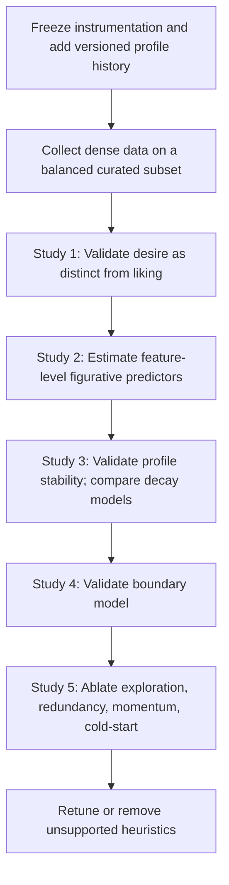

# Proposed Studies for the Vela Research Program

Five concrete study designs, with sample-size targets and primary metrics, extracted from the ChatGPT Deep Research literature review (2026-04-24). These fit the downstream-artifacts index in `docs/research/literature-map.md` §L as the "research proposals across time horizons" artifact. The ordering below reflects the recommended sequencing: construct-validate before ranking-optimise.

## Phase 0 — prerequisites

1. **Freeze instrumentation** — no coefficient tuning against the live engine until Phase 1 data lands.
2. **Add versioned profile history** (`user_desire_profile_versions` table, flagged in `docs/engine-room/02-instrument-validation.md` §4). Required for any longitudinal analysis.
3. **Confirm Phase 1 recruitment readiness** — the ASN-576..581 research-intake wave supplies participants; launch gate is ASN-567 (dimension-prior seeding) + ASN-570 (first-pass instrument validation).

## Five studies, in recommended order

### Study 1 — Desire vs. liking separation (RQ1)

- **Design:** Balanced repeated-measures on a curated subset. Stimuli chosen to span the 8 desire dimensions with controlled distribution of rating/save/dwell trajectories.
- **Sample target:** 300 participants, 40–50 trials each, 120–160 units balanced across dimensions.
- **Analysis:** Latent profile analysis (LPA) or mixture modelling on the response feature space {rating, saved, dwell_ms, boundary_flag, emotions[], intensity}. Compare 2-, 3-, and 4-class solutions using BIC, LMR-LRT, and entropy per Nylund et al. (2007).
- **Primary metrics:** Class enumeration entropy; BIC; predictive validity of class membership for future saves and returns; out-of-sample class stability.
- **Falsifiable prediction:** Desire (rating=high ∧ saved ∧ long dwell) is statistically separable from preference (rating=high alone) as distinct latent classes, not a single continuum.

### Study 2 — Figurative feature model (RQ2)

- **Design:** Crossed random-effects regression predicting response from decomposition features. Held-out prediction on units not seen during training.
- **Sample target:** 150–200 participants; 4,000–6,000 total responses; 200–300 units.
- **Analysis:** Multilevel regression with responses nested in units crossed with users; decomposition features (pose_type, gaze_direction, light_quality, intimacy_level, composition, rendering, etc.) as fixed effects; random intercepts per user. Complement with gradient-boosted model + SHAP values for feature importance.
- **Primary metrics:** Out-of-sample AUC on saved/not-saved; calibration; SHAP stability across cross-validation folds; ablation when feature families (embodiment vs. art-historical) are removed.
- **Falsifiable prediction:** Embodiment/social features (gaze, intimacy, pose) outperform art-historical features (medium, period, attribution) in predicting desire response.

### Study 3 — Longitudinal profile stability (RQ3)

- **Design:** Multi-session panel with versioned profile snapshots and alternative decay models.
- **Sample target:** 150 returning participants; 6–8 sessions over 8–10 weeks.
- **Analysis:** ICC(2,1) per Shrout & Fleiss (1979) on each of the 8 dimension scores across profile_version snapshots. Compare half-life constants (30d / 60d / 90d / no decay). Track confidence scores as N eligible responses grows.
- **Primary metrics:** ICC per dimension; profile drift magnitude; decay-model comparison (predictive AUC on future responses); confidence-to-stability relationship.
- **Falsifiable prediction:** Desire profiles are more stable than individual ratings but less stable than personality traits; the 60-day half-life is empirically defensible within ±30 days.

### Study 4 — Boundary model validation

- **Design:** Oversample challenging/negative content. Pre-register moderation by expertise (VAIAK) and art-context framing.
- **Sample target:** 120 participants.
- **Analysis:** Precision/recall for predicting future avoidance from accumulated boundary evidence. False-positive suppression rate. Recovery after aversive exposure (does the next session succeed or further suppress?).
- **Primary metrics:** Precision/recall on future avoidance; FP suppression of adjacent non-boundary content; session-continuation rates after boundary exposure.
- **Falsifiable prediction:** Boundary tag propagation generalises correctly within a similarity neighbourhood without over-suppressing adjacent content.

### Study 5 — Engine ablation trial

- **Design:** Randomised crossover or online interleaving. Current engine versus ablated variants: without momentum; without exploration quotas; without CLIP redundancy; simplified score rules.
- **Sample target:** 80–120 participants in research mode, or product traffic if available.
- **Analysis:** Per-variant comparison on session completion, save rate, dwell, novelty, boundary rate, repeat engagement, subjective burden.
- **Primary metrics:** Session-level engagement outcomes by variant; subjective UX (Knijnenburg ResQue subscales); per-dimension satisfaction.
- **Falsifiable prediction:** Any heuristic that cannot survive ablation against a simpler baseline should be demoted from "theory" to "implementation convenience."

## Mermaid — recommended sequencing

## Two standing decisions that follow from the literature

1. **Vela's current engine constants are not treated as psychologically licensed.** They are explicit instrument parameters that must be validated before being defended in publication.
2. **Any heuristic that cannot survive ablation against a simpler baseline is demoted** from "theory" to "implementation convenience."

## Downstream ASN candidates

Each study above is a candidate future assignment, dependent on recruitment readiness (ASN-576..581 wave). Suggested ASN structure when scoping:

| Study | Prerequisite | Lane |
|---|---|---|
| 1 — Desire vs. liking | ASN-576 landing + ASN-577 session surface + 300 consented participants | Claude Code (analysis scripts + preregistration) |
| 2 — Figurative feature model | Study 1 completion + 4,000+ responses | Claude Code (multilevel models + SHAP) |
| 3 — Profile stability | `user_desire_profile_versions` migration + 150 returning users | Claude Code (ICC + decay comparison) |
| 4 — Boundary validation | Oversampled boundary-candidate corpus | Claude Code + Cursor UI (pre-reg moderation) |
| 5 — Engine ablation | Feature-flag + variant routing infra | Cursor (UI gate + analysis) |
| 6 — Museum diversity-of-beauty (a) — museum vs. museum | Labeled-diversity overlay on existing museum corpora; preregistered protocol | Claude Code (corpus labeling + diversity indices + write-up) |

## Study 6 — Museum diversity-of-beauty, sub-question (a)

- **Framing:** treat each museum's corpus as itself a measurement of cultural taste over time; compare diversity across institutions on cultural representation, physical representation, temporal coverage, and medium. Bootstrap thread doc at `docs/research/papers/museum-diversity-of-beauty-research-questions.md`.
- **Design:** sample-equalised cross-museum comparison across at minimum five major institutions feeding Vela's discovery layer (Art Institute of Chicago, the Metropolitan Museum, Bibliothèque nationale de France, Smithsonian Open Access, Europeana). Corpora already in place via `scripts/artwork/sources/`.
- **Sample target:** N depends on the per-museum corpus size; at minimum a stratified sample of 1,000 representational works per museum. Stratification on figurative-vs-non-figurative committed in the protocol.
- **Analysis:** per-dimension diversity indices (Simpson, Shannon, or Jensen–Shannon) per museum; pairwise comparisons with Bonferroni or BH-adjusted alpha.
- **Primary metrics:** per-dimension diversity index per museum; pairwise divergence; descriptive ranking with confidence bands.
- **Limitations to own:** LLM-labeling reliability (the headline limitation; should be reported as inter-annotator-equivalent metrics against a hand-coded gold standard subset), sampling effects, the "what counts as figurative" curatorial line per museum.
- **Preregistration:** required before the analysis script runs. Filed at `docs/research/preregistrations/museum-diversity-of-beauty-a.md` (forthcoming under ASN-981).
- **Filed as:** **ASN-981**.
